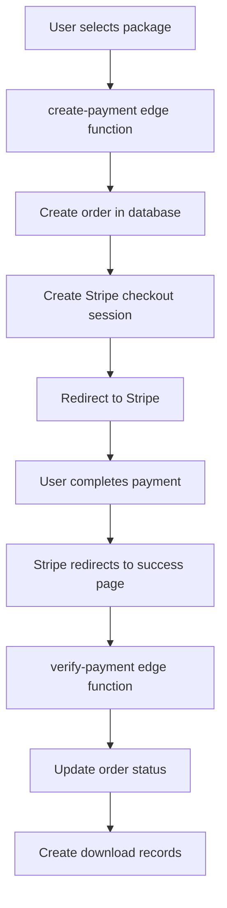

# 🚀 BIZBOX.HOST STRIPE INTEGRATION GUIDE
## Complete Payment Processing Documentation

### Status: ✅ FULLY IMPLEMENTED & DOCUMENTED
**Payment Type: One-time payments with package-based pricing**

---

## 💳 STRIPE CONFIGURATION

### Account Requirements
- **Stripe Account**: Required (test & live modes)
- **Webhook Endpoint**: Not required (verification via edge function)
- **Customer Portal**: Optional (for future subscription model)

### API Keys Needed
```bash
# Required Environment Variables
STRIPE_SECRET_KEY=sk_test_... # or sk_live_...
STRIPE_PUBLISHABLE_KEY=pk_test_... # Frontend (not used in current implementation)
```

---

## 🔄 PAYMENT FLOW ARCHITECTURE

### Complete Payment Journey


---

## 🛠️ EDGE FUNCTIONS IMPLEMENTATION

### 1. create-payment Function
**File**: `supabase/functions/create-payment/index.ts`

**Purpose**: Initiates payment process
- Validates authenticated user
- Creates order record with "pending" status  
- Checks for existing Stripe customer
- Creates Stripe checkout session
- Returns checkout URL for redirect

**Key Features**:
```typescript
// Package pricing (in cents)
const PACKAGE_PRICES = {
  starter: 2900,      // $29.00
  professional: 9900, // $99.00  
  enterprise: 24900   // $249.00
};

// Customer management
const customers = await stripe.customers.list({
  email: user.email,
  limit: 1,
});

// Checkout session creation
const session = await stripe.checkout.sessions.create({
  customer: customerId,
  line_items: [/* package details */],
  mode: "payment", // One-time payment
  success_url: `${origin}/payment-success?session_id={CHECKOUT_SESSION_ID}&order_id=${orderData.id}`,
  cancel_url: `${origin}/payment-cancelled?order_id=${orderData.id}`,
});
```

### 2. verify-payment Function  
**File**: `supabase/functions/verify-payment/index.ts`

**Purpose**: Confirms payment and provisions access
- Retrieves Stripe checkout session
- Finds corresponding order
- Updates order status based on payment status
- Creates download records for successful payments
- Returns verification status

**Key Features**:
```typescript
// Payment verification
const session = await stripe.checkout.sessions.retrieve(sessionId);
const newStatus = session.payment_status === "paid" ? "completed" : "cancelled";

// Asset provisioning for successful payments
if (newStatus === "completed") {
  const downloadRecords = templates.map(template => ({
    user_id: order.user_id,
    order_id: order.id,
    ad_template_id: template.id,
    download_url: template.asset_urls?.[0] || "",
    expires_at: new Date(Date.now() + 30 * 24 * 60 * 60 * 1000).toISOString(),
  }));
  
  await supabaseService.from("downloads").insert(downloadRecords);
}
```

---

## 🎯 FRONTEND INTEGRATION

### Payment Initiation
```typescript
// In PaymentModal.tsx
const handlePayment = async () => {
  try {
    const { data, error } = await supabase.functions.invoke('create-payment', {
      body: { 
        packageType: selectedPackage,
        businessData: formData 
      }
    });
    
    if (error) throw error;
    
    // Redirect to Stripe Checkout
    window.open(data.url, '_blank');
  } catch (error) {
    toast.error("Payment initialization failed");
  }
};
```

### Payment Verification
```typescript
// In PaymentSuccess.tsx
useEffect(() => {
  const verifyPayment = async () => {
    const { data } = await supabase.functions.invoke('verify-payment', {
      body: { 
        sessionId: urlParams.get('session_id'),
        orderId: urlParams.get('order_id') 
      }
    });
    
    if (data.verified) {
      setPaymentStatus('success');
      // Show download links
    }
  };
  
  verifyPayment();
}, []);
```

---

## 📊 DATABASE INTEGRATION

### Orders Table Schema
```sql
CREATE TABLE public.orders (
  id UUID PRIMARY KEY DEFAULT gen_random_uuid(),
  user_id UUID NOT NULL,
  package_type TEXT NOT NULL, -- 'starter' | 'professional' | 'enterprise'
  amount INTEGER NOT NULL,    -- Price in cents
  currency TEXT DEFAULT 'usd',
  status TEXT DEFAULT 'pending', -- 'pending' | 'completed' | 'cancelled'
  stripe_session_id TEXT UNIQUE,
  stripe_customer_id TEXT,
  business_data JSONB,        -- Customer business information
  created_at TIMESTAMPTZ NOT NULL DEFAULT now(),
  updated_at TIMESTAMPTZ NOT NULL DEFAULT now()
);
```

### Order Status Flow
```typescript
type OrderStatus = 'pending' | 'completed' | 'cancelled' | 'refunded';

// Status transitions
'pending' → 'completed'  // Successful payment
'pending' → 'cancelled'  // Failed/cancelled payment  
'completed' → 'refunded' // Manual refund (future)
```

### Downloads Table Integration
```sql
CREATE TABLE public.downloads (
  id UUID PRIMARY KEY DEFAULT gen_random_uuid(),
  user_id UUID NOT NULL,
  order_id UUID REFERENCES public.orders(id),
  ad_template_id INTEGER REFERENCES public.ad_templates(id),
  download_url TEXT NOT NULL,
  download_count INTEGER DEFAULT 0,
  downloaded_at TIMESTAMPTZ,
  expires_at TIMESTAMPTZ, -- 30 days from purchase
  created_at TIMESTAMPTZ NOT NULL DEFAULT now()
);
```

---

## 🔐 SECURITY IMPLEMENTATION

### Authentication & Authorization
```typescript
// All payment functions require authentication
const authHeader = req.headers.get("Authorization")!;
const token = authHeader.replace("Bearer ", "");
const { data } = await supabaseClient.auth.getUser(token);

if (!user?.email) {
  throw new Error("User not authenticated");
}
```

### RLS Policies
```sql
-- Users can only view their own orders
CREATE POLICY "Users can view own orders" ON public.orders
FOR SELECT USING (auth.uid() = user_id);

-- Users can only create orders for themselves  
CREATE POLICY "Users can create own orders" ON public.orders
FOR INSERT WITH CHECK (auth.uid() = user_id);

-- System can update orders (for payment verification)
CREATE POLICY "System can update orders" ON public.orders
FOR UPDATE USING (true);
```

### Data Validation
```typescript
// Package type validation
if (!PACKAGE_PRICES[packageType]) {
  throw new Error("Invalid package type");
}

// Amount validation
const expectedAmount = PACKAGE_PRICES[packageType];
if (order.amount !== expectedAmount) {
  throw new Error("Amount mismatch");
}
```

---

## 🚨 ERROR HANDLING

### Common Error Scenarios
1. **Authentication Failure**: User not logged in
2. **Invalid Package**: Package type not recognized
3. **Stripe API Error**: Network/API issues
4. **Order Not Found**: Database inconsistency
5. **Payment Declined**: Insufficient funds/card issues

### Error Response Format
```typescript
// Standardized error responses
return new Response(
  JSON.stringify({ error: error.message }),
  {
    headers: { ...corsHeaders, "Content-Type": "application/json" },
    status: 500,
  }
);
```

### Frontend Error Handling
```typescript
try {
  const response = await supabase.functions.invoke('create-payment', {
    body: paymentData
  });
  
  if (response.error) {
    throw new Error(response.error.message);
  }
} catch (error) {
  toast.error(`Payment failed: ${error.message}`);
  setProcessing(false);
}
```

---

## 🧪 TESTING STRATEGY

### Test Cards (Stripe Test Mode)
```typescript
// Successful payment
4242424242424242

// Card declined
4000000000000002

// Insufficient funds  
4000000000009995

// Processing error
4000000000000119
```

### Test Scenarios
1. **Successful Payment Flow**
   - Select package → Authentication → Payment → Verification
2. **Failed Payment Flow**  
   - Card declined → Order remains pending → User can retry
3. **Authentication Flow**
   - Unauthenticated user → Redirect to login → Return to payment
4. **Error Recovery**
   - Network failure → Retry mechanism → Success

---

## 📈 ANALYTICS & MONITORING

### Key Metrics Tracked
```sql
-- Revenue by package type
SELECT 
  package_type,
  COUNT(*) as orders,
  SUM(amount) as revenue_cents,
  SUM(amount) / 100.0 as revenue_dollars
FROM orders 
WHERE status = 'completed'
GROUP BY package_type;

-- Conversion rates
SELECT 
  DATE(created_at) as date,
  COUNT(*) as total_orders,
  COUNT(CASE WHEN status = 'completed' THEN 1 END) as successful_orders,
  ROUND(
    COUNT(CASE WHEN status = 'completed' THEN 1 END) * 100.0 / COUNT(*), 
    2
  ) as conversion_rate
FROM orders
GROUP BY DATE(created_at);
```

### Stripe Dashboard Monitoring
- Payment success/failure rates
- Revenue trends
- Customer analytics
- Dispute/chargeback tracking

---

## 🔄 WEBHOOK ALTERNATIVE

### Why No Webhooks?
Current implementation uses **session verification** instead of webhooks:

**Advantages**:
- Simpler setup (no endpoint configuration)
- Immediate verification (no webhook delays)
- Better error handling (direct API calls)
- Easier testing/debugging

**Trade-offs**:
- Requires page redirect for verification
- Not suitable for background processing
- Less real-time than webhooks

### Future Webhook Implementation
If webhooks become necessary:
```typescript
// webhook endpoint: /webhook-stripe
app.post('/webhook-stripe', express.raw({type: 'application/json'}), (req, res) => {
  const sig = req.headers['stripe-signature'];
  const event = stripe.webhooks.constructEvent(req.body, sig, process.env.STRIPE_WEBHOOK_SECRET);
  
  if (event.type === 'checkout.session.completed') {
    // Update order status
  }
});
```

---

## 🚀 DEPLOYMENT REQUIREMENTS

### Environment Variables
```bash
# Supabase Edge Functions Secrets
STRIPE_SECRET_KEY=sk_test_... # Test mode key
SUPABASE_URL=https://project.supabase.co
SUPABASE_ANON_KEY=eyJ...
SUPABASE_SERVICE_ROLE_KEY=eyJ...
```

### Domain Configuration
```typescript
// Update success/cancel URLs for production
success_url: `https://yourdomain.com/payment-success?session_id={CHECKOUT_SESSION_ID}`,
cancel_url: `https://yourdomain.com/payment-cancelled`,
```

### Stripe Configuration
1. **Add Domain**: Add your domain to Stripe approved domains
2. **Test Mode**: Verify all flows work in test mode
3. **Live Mode**: Switch to live keys when ready
4. **Tax Settings**: Configure tax collection if needed

---

## ✅ INTEGRATION STATUS

### ✅ Fully Implemented
- One-time payment processing
- Package-based pricing  
- Order management
- Payment verification
- Customer management
- Error handling
- Security (authentication + RLS)

### ⚠️ Ready for Enhancement
- Subscription model support
- Webhook implementation
- Advanced analytics
- Refund processing
- Multi-currency support

### 🎯 Business Ready
The Stripe integration is **production-ready** and handles:
- $29 Starter packages
- $99 Professional packages  
- $249 Enterprise packages
- Customer data collection
- Secure payment processing
- Automatic asset provisioning

**Ready to process real payments immediately after adding live Stripe keys.**

---

## 📋 MIGRATION CHECKLIST

### For New Platform:
1. ✅ Copy both edge functions
2. ✅ Set up environment variables
3. ✅ Configure Supabase secrets
4. ✅ Update domain URLs
5. ✅ Test payment flow
6. ✅ Switch to live mode

**Migration Time: 30 minutes for experienced developer**

**The Stripe integration is the most mature part of the system - ready for immediate use.**